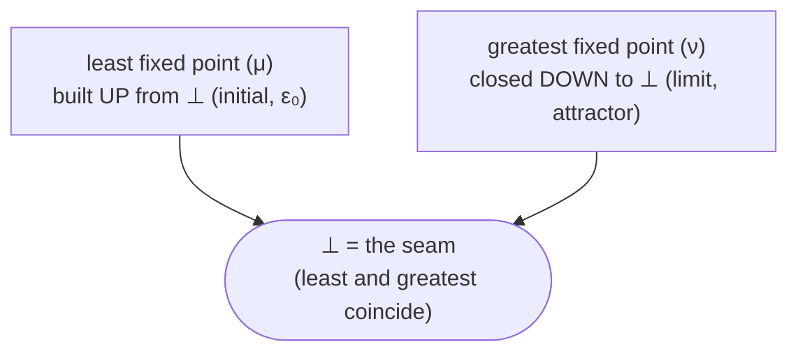
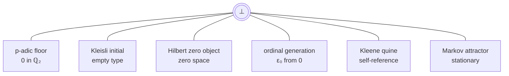

# The Bottom Element (⊥) - Dictionary and Map

*A dictionary and map of the framework's bottom element ⊥ - what it is, what it is not, and where each characterization is established, most with a machine-checked Lean witness linked to the source.*

  

For the formal framework index and Lean verification, see [README](README.md). For plain-language introductions, companions, and reading paths, see [GUIDE](GUIDE.md). For the claim-by-claim status of every result, see the [Claims Ledger](CLAIMS.md).

---

## What this is

This is a **reference** for the framework's bottom element ⊥: a **dictionary** (what ⊥ is and is not) and a
**map** (where each characterization is established). It is a **beginning, not a resolution.** What is
*proved* is that each construction's bottom belongs to the family and that the slot structure recurs; that
the various bottoms are *one object* stays a conjecture - they are provably distinct as structures (the
"walls"). It closes a standing gap: a framework built on ⊥ that had not yet characterized ⊥ itself.

---

## Reading key (for a reader with no prior context)

**Slot codes** (the map columns, and the positive dictionary entries):

| code | what it means |
|---|---|
| CANT | **cannot-have** - what ⊥ provably is NOT (its exclusions) |
| NARR | **narrow** - ⊥ is a single, unique point |
| MEAS | **measure** - some quantity becomes infinite exactly at ⊥ |
| REACH | **reach** - ⊥ is what nearby points converge to (an attractor) |
| INV | **inversion** - the map z↦1/z swaps ⊥ (which is 0) with infinity (the two poles of a Riemann sphere) |
| CONC | **concurrency** - applying ⊥'s own operation returns ⊥ unchanged (a fixed point: operation and result coincide) |
| SELF | **self-reference** - ⊥ is defined by referring to itself (a self-reproducing / self-containing object) |
| GEN | **generation** - ⊥ generates the structure built above it (for example, the ordinal ε₀ generated from 0) |
| DYN | **dynamics** - how ⊥ is approached over time and departed from irreversibly |

**Constructions** (the map rows; the `#` numbers are node labels from the framework's bottom-diagram
comparison):

| construction (map row) | what it means |
|---|---|
| Lat ⊥ (ZPA/ZPE) | the abstract order bottom: ⊥ as the least element of the framework's lattice |
| p-adic (ℚ₂/ℤ₂) | the number 0 in the 2-adic numbers (the floor of the 2-adic distance) |
| Info (ZPC) | the information-theoretic bottom, where surprisal / information grows without bound |
| #4 Kleisli (Fin 0) | the empty type, as the initial object of a probability (Kleisli) category |
| #5 Hilbert (zero obj/seam) | the zero vector space, as the zero object of a linear category (the 'seam') |
| #3 TopCat ({0} limit) | the one-point space {0}, obtained as a topological limit of shrinking balls |
| #2 Markov (attractor) | the stationary distribution a random walk settles into |
| Kleene (quine, ZPK) | the self-reproducing program (Kleene fixed point) of computability |
| ε₀ (ordinal, ZPL/M) | the ordinal ε₀, generated from 0 by iterating omega-to-the-power |
| selfApp (abstract ⊥) | the abstract self-application ⊥: the unique fixed point of a self-map |

**A few recurring terms:**

| term | plain meaning |
|---|---|
| apophatic | characterizing something by what it is NOT (definition by exclusion) |
| μ / ν | least fixed point (μ, built up from the floor) vs greatest fixed point (ν, closed down) |
| Quine atom / Kleene quine | a self-containing set (x = {x}) / a program that prints itself |
| the snap | the framework's discrete jump off ⊥ into the first structured state |
| ε₀ | the ordinal reached by iterating omega-to-the-power from 0 (a proof-theoretic ceiling) |
| v₂ → ∞ | the 2-adic valuation going to infinity at 0 (0 is infinitely divisible by 2) |

---

## Dictionary

### ⊥ cannot be (characterization by exclusion)

| # | ⊥ cannot be... | witness (links to Lean source) |
|---|---|---|
| A1 | a Lean term or otherwise finitely written down (⊥ is descriptionless, so any written form is already a description of it) | *meta (no Lean witness)* |
| A2 | anything that keeps time, space, description, measure or structure (that would be an *interpretation* of ⊥, not ⊥) | *meta (no Lean witness)* |
| A3 | finite: ⊥ is by definition the point where every finite measure diverges to infinity | *meta (no Lean witness)* |
| B1 | the same object as both the proof-theory floor and the attractor floor (one is well-founded, the other is not) | [`no_strictMono_real_to_ordinal`](ZeroParadox/ZPH_MC1_TreeObstructions.lean), [`simplex_antichain`](ZeroParadox/ZPH_MC1_TreeObstructions.lean) |
| B2 | the same object as a categorical initial bottom, if it is a topological limit bottom (their universal properties point opposite ways) | [`padic_bottom_not_initial`](ZeroParadox/ZPH_MC1_TreeObstructions.lean), [`split_kleisli_vs_hilbert`](ZeroParadox/ZPH_MC1_TreeObstructions.lean) |
| B4 | reached by a comparison that preserves the 'closed-down' (ν) structure - you can only get to ⊥ by forgetting that structure | [`faithful_iff_descending`](ZeroParadox/ZPH_MC1_TC22.lean) |
| B5 | unified with its self-referential face in a structure-preserving way - the two coincide only as a bare point | [`faces_iso_unique`](ZeroParadox/ZPH_TwoFacesBot.lean) |
| C1 | forced to a single point as a Markov bottom (#2): a reducible chain settles into a whole family of distributions, not one | [`markov_node_no_universal_property`](ZeroParadox/ZPH_MC1_TC23.lean) |
| C3 | an *initial* object of the category of spaces (the p-adic floor behaves like a limit / terminal object, the opposite) | [`padic_bottom_not_initial`](ZeroParadox/ZPH_MC1_TreeObstructions.lean) |
| D1 | a *zero object* (both initial and terminal) of the Kleisli or p-adic categories | [`kleisli_bottom_not_zero`](ZeroParadox/ZPH_MC1_TC08.lean), [`padic_bottom_not_zero`](ZeroParadox/ZPH_MC1_TC08.lean) |
| D2 | a *greatest* element (it is the floor, not the top) | [`zpa_bot_not_greatest`](ZeroParadox/ZPH_MC1_TC08.lean) |
| D4 | an inhabited least-fixed-point for the identity functor: that least fixed point is provably empty | [`strict_fix_isEmpty`](ZeroParadox/ZPH_MC1_TC47.lean), [`fix_isEmpty_constructive`](ZeroParadox/ZPH_MC1_TC48.lean) |
| D5 | recovered by mapping the least fixed point onto the greatest: the comparison map is not onto | [`fixToCofix_not_surjective`](ZeroParadox/ZPH_MC1_TC49.lean) |
| D6 | reached by a non-contracting orbit: unit-norm and swap orbits provably do not converge to ⊥ | [`unit_orbit_not_tendsto_zero`](ZeroParadox/ZPH_MC1_TC30.lean), [`swap_orbit_not_convergent`](ZeroParadox/ZPH_MC1_TC39.lean) |

### ⊥ is (positive handles - the slots)

The handles sort by **aspect**: what ⊥ *is* (**noun**), what ⊥ *does* (**verb**), or **both at once**
(**hinge**). The hinge is ⊥'s signature: at the floor the two collapse - the fixed point that *is* a thing
and *acts on itself* in one step (operation = result). *This noun-and-verb reading, and the claim that they
collapse at ⊥, is the framework's interpretation; the slot witnesses below are proved, the lens over them is
not.*

| slot | aspect | characterization of ⊥ | witness (links to Lean source) |
|---|---|---|---|
| narrow | noun | the single, unique pinned point | [`q2_unique_fp`](ZeroParadox/ZPJ_SelfApp.lean), [`fB_bottom_is_limit`](ZeroParadox/ZPH_TopFunctor.lean) |
| measure | noun | a quantity that becomes infinite exactly at ⊥ | [`t2_diverges`](ZeroParadox/ZPC.lean), [`addVal_bot`](ZeroParadox/ZPB_FloorWitness.lean) |
| reach | verb | an attractor: *contracting* orbits converge to ⊥ (not all orbits - see D6) | [`contraction_orbit_tendsto_zero`](ZeroParadox/ZPH_MC1_TC30.lean) |
| inversion | verb | the 0 = ∞ pole: the map z↦1/z swaps 0 and infinity | [`rInv_swaps`](ZeroParadox/ZPP_RiemannSphere.lean), [`inversion_reverses_filtration`](ZeroParadox/ZPP_InversionValuation.lean) |
| concurrency | hinge | the fixed point where least and greatest coincide (operation = result) | [`unique_fp`](ZeroParadox/ZPJ_SelfApp.lean), [`selfApp_bot_is_both_extremal`](ZeroParadox/ZPH_MC1_TC15.lean) |
| self-reference | hinge | the self-reproducing / self-containing fixed point (Quine / Kleene) | [`kleene_quine_is_bot`](ZeroParadox/ZPK.lean), [`quine_period_is_goedel`](ZeroParadox/ZPK.lean) |
| generation | verb | the floor generates the ceiling (ε₀ = the closure of 0 under omega-to-the-power) | [`epsilonZero_eq_nfp`](ZeroParadox/ZPL.lean) |
| dynamics | verb | approached as orbits reach it, and departed irreversibly (the snap) | [`t_snap_derived`](ZeroParadox/ZPE.lean), [`fC_no_return`](ZeroParadox/ZPH_InfoFunctor.lean), [`fullMix_not_injective`](ZeroParadox/ZPH_MarkovSpectralGap.lean) |

---

## Map - slot × construction

Where each characterization is established. `✓` = established, `✓*` = conditional/bridge, blank = **open
probe**. (The witnessing theorem - and whether it is proved here or cited from a library - is in the
dictionary above, with links to the Lean source.)

| construction | CANT | NARR | MEAS | REACH | INV | CONC | SELF | GEN | DYN |
|---|:--:|:--:|:--:|:--:|:--:|:--:|:--:|:--:|:--:|
| Lat ⊥ (ZPA/ZPE) | ✓ | ✓ |  |  |  |  |  |  | ✓ |
| p-adic (ℚ₂/ℤ₂) | ✓ | ✓ | ✓ | ✓ | ✓ | ✓ | ✓* |  | ✓ |
| Info (ZPC) |  |  | ✓ |  |  |  |  |  |  |
| #4 Kleisli (Fin 0) | ✓ | ✓ |  |  | ✓ |  |  |  | ✓ |
| #5 Hilbert (zero obj/seam) |  | ✓ |  |  | ✓ | ✓ | ✓ |  | ✓ |
| #3 TopCat ({0} limit) | ✓ | ✓ |  |  |  |  |  |  |  |
| #2 Markov (attractor) | ✓ | ✓* |  | ✓ |  | ✓ |  |  | ✓ |
| Kleene (quine, ZPK) | ✓ | ✓ | ✓ | ✓ |  | ✓ | ✓ |  |  |
| ε₀ (ordinal, ZPL/M) |  | ✓ | ✓ | ✓ |  | ✓ | ✓* | ✓ | ✓ |
| selfApp (abstract ⊥) | ✓ | ✓ |  |  |  | ✓ | ✓ |  |  |

The blanks are the honest part: they are open probes, and two columns (**inversion**, **generation**) sit in
one construction each - structural facts (inversion is the p-adic / Riemann phenomenon; generation is the
build-up-from-the-floor side), not gaps to paper over.

---

## Structure diagrams

> **Sizing** (Mermaid auto-lays-out; the risk is sprawl, not overflow). Target: at most about 8 nodes, short
> labels, fits one screen. Flow/tree stays shallow; a hub/fan is 1 hub with up to about 6 short spokes.

### The μ / ν fork - ⊥ as the seam
*3 nodes, width 2, depth 2.*

### Where ⊥ appears - the constructions
*7 nodes, hub-and-fan, depth 2. (That these are all one referent is the open conjecture, not shown as fact.)*

---

*Generated from `bottom_cannot_be.md` and the matrix data by `build_dictionary_map.py`. Witness names are
resolved against the Lean source at generation time and link to the file that declares them; the `meta`
entries (marked as such) have no Lean witness. To update: edit a source and rerun. Mermaid and the links
render natively on GitHub.*
