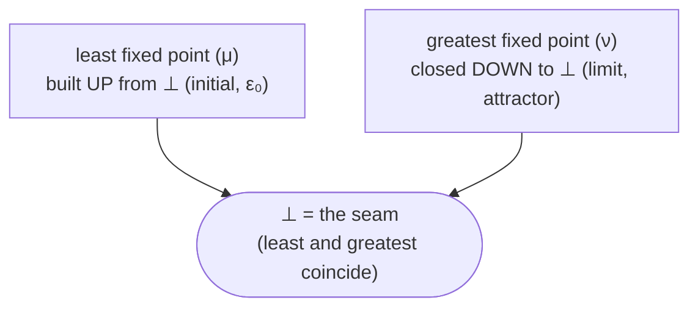
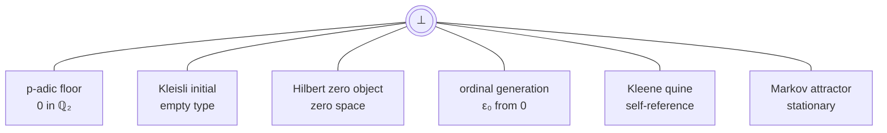

# The Bottom Element (⊥) - Dictionary and Map

*A dictionary and map of the framework's bottom element ⊥ - what it is, what it is not, and where each characterization is established, most with a machine-checked Lean witness linked to the source.*

  

For the formal framework index and Lean verification, see [README](README.md). For plain-language introductions, companions, and reading paths, see [GUIDE](GUIDE.md). For the claim-by-claim status of every result, see the [Claims Ledger](CLAIMS.md).

---

## What this is

This is a **reference** for the framework's bottom element ⊥: a **dictionary** (what ⊥ is and is not) and a
**map** (where each characterization is established). It is a **beginning, not a resolution.** What is
*proved* is that each construction's bottom belongs to the family and that the slot structure recurs; that
the various bottoms are *one object* stays a conjecture - they are provably distinct as structures (the
"walls"). It closes a standing gap: a framework built on ⊥ that had not yet characterized ⊥ itself.

---

## Reading key (for a reader with no prior context)

**Slot codes** (the map columns, and the positive dictionary entries):

| code | what it means |
|---|---|
| CANT | **cannot-have** - what ⊥ provably is NOT (its exclusions) |
| NARR | **narrow** - ⊥ is a single, unique point |
| MEAS | **measure** - some quantity becomes infinite exactly at ⊥ |
| INV | **inversion** - the map z↦1/z swaps ⊥ (which is 0) with infinity (the two poles of a Riemann sphere) |
| CONC | **concurrency** - applying ⊥'s own operation returns ⊥ unchanged (a fixed point: operation and result coincide) |
| SELF | **self-reference** - ⊥ is defined by referring to itself (a self-reproducing / self-containing object) |
| GEN | **generation** - ⊥ generates the structure built above it (for example, the ordinal ε₀ generated from 0) |
| DYN | **dynamics** - how ⊥ is approached and departed, one directional axis with two sub-senses: **↓ inbound** (orbits converge *to* ⊥ - a sink) and **↑ outbound** (structure departs *from* ⊥ irreversibly - a source). ↕ = both, which happens only at a seam (μ=ν). Single-directional, set by whether ⊥ is a sink or a source |

**Constructions** (the map rows). A `#N` prefix (#2 Markov, #3 TopCat/p-adic limit, #4 Kleisli, #5 Hilbert
seam) cross-references the **bottom-diagram-tree nodes** used throughout the Lean source (`node #4`,
`seam node #5`, …). Only those four appear as numbered rows; the tree's order-floor node #1 is the abstract
`Lat ⊥` row (shown here without the number), and the other rows (Info, Kleene, ε₀, selfApp, the p-adic
valuation) come from other layers. The partial numbering is scoped, not missing data:

| construction (map row) | what it means |
|---|---|
| Lat ⊥ (ZPA/ZPE) | the abstract order bottom: ⊥ as the least element of the framework's lattice |
| p-adic (ℚ₂/ℤ₂) | the number 0 in the 2-adic numbers (the floor of the 2-adic distance) |
| Info (ZPC) | the information-theoretic bottom, where surprisal / information grows without bound |
| #4 Kleisli (Fin 0) | the empty type, as the initial object of a probability (Kleisli) category |
| #5 Hilbert (zero obj/seam) | the zero vector space, as the zero object of a linear category (the 'seam') |
| #3 TopCat ({0} limit) | the one-point space {0}, obtained as a topological limit of shrinking balls |
| #2 Markov (attractor) | the stationary distribution a random walk settles into |
| Kleene (quine, ZPK) | the self-reproducing program (Kleene fixed point) of computability |
| ε₀ (ordinal, ZPL/M) | the ordinal ε₀, generated from 0 by iterating omega-to-the-power |
| selfApp (abstract ⊥) | the abstract self-application ⊥: the unique fixed point of a self-map |

**A few recurring terms:**

| term | plain meaning |
|---|---|
| apophatic | characterizing something by what it is NOT (definition by exclusion) |
| μ / ν | least fixed point (μ, built up from the floor) vs greatest fixed point (ν, closed down) |
| Quine atom / Kleene quine | a self-containing set (x = {x}) / a program that prints itself |
| the snap | the framework's discrete jump off ⊥ into the first structured state |
| ε₀ | the ordinal reached by iterating omega-to-the-power from 0 (a proof-theoretic ceiling) |
| v₂ → ∞ | the 2-adic valuation going to infinity at 0 (0 is infinitely divisible by 2) |

---

## Dictionary

### ⊥ cannot be (characterization by exclusion)

| ⊥ cannot be... | witness (links to Lean source) |
|---|---|
| a Lean term or otherwise finitely written down (⊥ is descriptionless, so any written form is already a description of it) | *meta (no Lean witness)* |
| anything that keeps time, space, description, measure or structure (that would be an *interpretation* of ⊥, not ⊥) | *meta (no Lean witness)* |
| finite: ⊥ is by definition the point where every finite measure diverges to infinity | *meta (no Lean witness)* |
| the same object as both the proof-theory floor and the attractor floor (one is well-founded, the other is not) | [`no_strictMono_real_to_ordinal`](ZeroParadox/Multihomed/TreeObstructions.lean), [`simplex_antichain`](ZeroParadox/Multihomed/TreeObstructions.lean) |
| the same object as a categorical initial bottom, if it is a topological limit bottom (their universal properties point opposite ways) | [`padic_bottom_not_initial`](ZeroParadox/Multihomed/TreeObstructions.lean), [`split_kleisli_vs_hilbert`](ZeroParadox/Multihomed/TreeObstructions.lean) |
| reached by a comparison that preserves the 'closed-down' (ν) structure - you can only get to ⊥ by forgetting that structure | [`faithful_iff_descending`](ZeroParadox/Multihomed/WallSpanRobust.lean) |
| unified with its self-referential face in a structure-preserving way - the two coincide only as a bare point | [`faces_iso_unique`](ZeroParadox/Multihomed/TwoFacesBot.lean) |
| forced to a single point as a Markov bottom (#2): a reducible chain settles into a whole family of distributions, not one | [`markov_node_no_universal_property`](ZeroParadox/Computability/MarkovNuUniversal.lean) |
| an *initial* object of the category of spaces (the p-adic floor behaves like a limit / terminal object, the opposite) | [`padic_bottom_not_initial`](ZeroParadox/Multihomed/TreeObstructions.lean) |
| a *zero object* (both initial and terminal) of the Kleisli or p-adic categories | [`kleisli_bottom_not_zero`](ZeroParadox/Category/SeamUniqueness.lean), [`padic_bottom_not_zero`](ZeroParadox/Category/SeamUniqueness.lean) |
| a *greatest* element (it is the floor, not the top) | [`zpa_bot_not_greatest`](ZeroParadox/Category/SeamUniqueness.lean) |
| an inhabited least-fixed-point for the identity functor: that least fixed point is provably empty | [`strict_fix_isEmpty`](ZeroParadox/Computability/RootCutTrichotomy.lean), [`fix_isEmpty_constructive`](ZeroParadox/Computability/ChoicePurityInvariant.lean) |
| recovered by mapping the least fixed point onto the greatest: the comparison map is not onto | [`fixToCofix_not_surjective`](ZeroParadox/Computability/NatListRegime.lean) |
| reached by a non-contracting orbit: unit-norm and swap orbits provably do not converge to ⊥ | [`unit_orbit_not_tendsto_zero`](ZeroParadox/Valuation/ContractionRate.lean), [`swap_orbit_not_convergent`](ZeroParadox/Order/MarkovContractionDual.lean) |

### ⊥ is (positive handles - the slots)

The handles sort by **aspect**: what ⊥ *is* (**noun**), what ⊥ *does* (**verb**), or **both at once**
(**hinge**). The hinge is ⊥'s signature: at the floor the two collapse - the fixed point that *is* a thing
and *acts on itself* in one step (operation = result). *This noun-and-verb reading, and the claim that they
collapse at ⊥, is the framework's interpretation; the slot witnesses below are proved, the lens over them is
not.*

| slot | aspect | characterization of ⊥ | witness (links to Lean source) |
|---|---|---|---|
| narrow | noun | the single, unique pinned point | [`q2_unique_fp`](ZeroParadox/Computability/SelfApp.lean), [`fB_bottom_is_limit`](ZeroParadox/Valuation/TopFunctor.lean) |
| measure | noun | a quantity that becomes infinite exactly at ⊥ | [`t2_diverges`](ZeroParadox/Information/Surprisal.lean), [`addVal_bot`](ZeroParadox/Valuation/FloorWitness.lean) |
| inversion | verb | the 0 = ∞ pole: the map z↦1/z swaps 0 and infinity | [`rInv_swaps`](ZeroParadox/Valuation/RiemannSphere.lean), [`inversion_reverses_filtration`](ZeroParadox/Valuation/InversionValuation.lean) |
| concurrency | hinge | the fixed point where least and greatest coincide (operation = result) | [`unique_fp`](ZeroParadox/Computability/SelfApp.lean), [`selfApp_bot_is_both_extremal`](ZeroParadox/Multihomed/SelfAppSeam.lean) |
| self-reference | hinge | the self-reproducing / self-containing fixed point (Quine / Kleene) | [`kleene_quine_is_bot`](ZeroParadox/Computability/Kleene.lean), [`quine_period_is_goedel`](ZeroParadox/Computability/Kleene.lean) |
| generation | verb | the floor generates the ceiling (ε₀ = the closure of 0 under omega-to-the-power) | [`epsilonZero_eq_nfp`](ZeroParadox/Ordinal/Gentzen.lean) |
| dynamics | verb | ⊥'s one-way approach and departure - two sub-senses: **inbound** (↓, orbits converge *to* ⊥ - a sink) and **outbound** (↑, structure departs *from* ⊥ irreversibly - a source); ↕ = both, only at a seam (μ=ν) | [`contraction_orbit_tendsto_zero`](ZeroParadox/Valuation/ContractionRate.lean), [`t_snap_derived`](ZeroParadox/Order/Snap.lean), [`c3_irreversible`](ZeroParadox/Valuation/Padic.lean), [`fC_no_return`](ZeroParadox/Multihomed/InfoFunctor.lean) |

---

## Map - slot × construction

Where each characterization stands. Most columns are a **claim with a status**, not a checkbox: `✓` **Lean-verified** - a machine-checked proof, with the witness theorem linked in *Why each cell* below ·
`✗` refuted (a proved obstruction, also Lean-checked) · `∅` not-applicable by structure (a category
error - e.g. asking a ν-limit for a μ-generation property - not a gap). A trailing `*` on any mark (`✓*`, `↑*`, `↓*`) means conditional - established via a bridge or inherited from a sibling layer. The last column,
**dynamics**, is DIRECTIONAL instead: `↓` inbound (converges *to* ⊥ - a sink), `↑` outbound (departs *from* ⊥
irreversibly - a source), `↕` both (a seam). (Witnessing theorems, with links to the Lean source, are in the
dictionary above.)

| construction | CANT | NARR | MEAS | INV | CONC | SELF | GEN | DYN |
|---|:--:|:--:|:--:|:--:|:--:|:--:|:--:|:--:|
| Lat ⊥ (ZPA/ZPE) | ✓ | ✓ | ∅ | ∅ | ✓* | ✓* | ∅ | ↑ |
| p-adic (ℚ₂/ℤ₂) | ✓ | ✓ | ✓ | ✓ | ✓ | ✓* | ∅ | ↓ |
| Info (ZPC) | ✓* | ∅ | ✓ | ∅ | ∅ | ✓* | ∅ | ↑* |
| #4 Kleisli (Fin 0) | ✓ | ✓ | ∅ | ✓ | ✗ | ∅ | ✓ | ↑ |
| #5 Hilbert (zero obj/seam) | ✓ | ✓ | ∅ | ✓ | ✓ | ✓ | ∅ | ↕ |
| #3 TopCat ({0} limit) | ✓ | ✓ | ∅ | ∅ | ∅ | ∅ | ∅ | ↓* |
| #2 Markov (attractor) | ✓ | ✓* | ∅ | ∅ | ✓ | ∅ | ∅ | ↓ |
| Kleene (quine, ZPK) | ✓ | ✓ | ✓ | ∅ | ✓ | ✓ | ∅ | ↓ |
| ε₀ (ordinal, ZPL/M) | ✓* | ✓ | ✓ | ∅ | ✓ | ✓* | ✓ | ↕ |
| selfApp (abstract ⊥) | ✓ | ✓ | ∅ | ∅ | ✓ | ✓ | ∅ | ↑* |

The honest content is in the non-`✓` cells, and splitting them is the point: a `∅`
is a settled structural fact (a category error, not a gap), a `✗` is news (a proved obstruction), and a `✓*` holds only via a bridge. Two things worth reading off the table:
(1) **generation** (GEN) is the μ / build-up-from-the-floor side, so the ν-bottoms (p-adic, Markov, the TopCat
point-limit) read `∅` there - a ν-object has no μ-property - and the self-coincident fixed points (Kleene,
selfApp) carry SELF rather than GEN; GEN's one live cell is ε₀, where the floor generates a *distinct* ceiling.
(2) The **dynamics** column is single-directional - `↓` for a sink (ν), `↑` for a source (μ) - and `↕` (both)
appears *only* at a seam (μ=ν): the zero-object seam **#5 Hilbert**, and **ε₀**, whose row is itself the snap-arc
0→ε₀. So ⊥'s dynamics has one direction, fixed by whether ⊥ is a source or a sink.

**The value is in the non-`✓` cells** - the proved obstructions (`✗`) and the structural non-applicabilities (`∅`), not the
filled count. The full reasoning behind the `GEN` and `dynamics` columns is written up in
**[Structural Findings](BOTTOMELEMENT_findings.md)**; the reason or witness behind *every* mark is below.

<b>Why each cell</b> - the reason or witness behind every mark (click to expand)

**Lat ⊥ (ZPA/ZPE)**
- `CANT` ✓ - [`zpa_bot_not_greatest`](ZeroParadox/Category/SeamUniqueness.lean)
- `NARR` ✓ - [`da2_bottom_characterization`](ZeroParadox/Order/Snap.lean)
- `MEAS` ∅ - bare ZPSemilattice has no metric/valuation scalar to diverge
- `INV` ∅ - a join-semilattice has no top / complement / involution to swap ⊥ with
- `CONC` ✓* - [`selfApp_bot_is_both_extremal`](ZeroParadox/Multihomed/SelfAppSeam.lean)
- `SELF` ✓* - [`derived_bot_self_mem`](ZeroParadox/Computability/SelfApp.lean)
- `GEN` ∅ - no infinite joins to form ⊔ₙfⁿ(⊥); ε₀-generation lives in the ordinal row
- `DYN` ↑ - [`t_snap_derived`](ZeroParadox/Order/Snap.lean) (⊥=c₀ departs to c₁ - source/μ)

**p-adic (ℚ₂/ℤ₂)**
- `CANT` ✓ - [`padic_bottom_not_initial`](ZeroParadox/Multihomed/TreeObstructions.lean)
- `NARR` ✓ - [`fB_bottom_is_limit`](ZeroParadox/Valuation/TopFunctor.lean)
- `MEAS` ✓ - [`addVal_bot`](ZeroParadox/Valuation/FloorWitness.lean)
- `INV` ✓ - [`rInv_swaps`](ZeroParadox/Valuation/RiemannSphere.lean) (Riemann sphere 0↔∞)
- `CONC` ✓ - [`q2_zero_is_fixed`](ZeroParadox/Computability/SelfApp.lean)
- `SELF` ✓* - [`valuation_bot_is_quine`](ZeroParadox/Valuation/ValuationAFA.lean)
- `GEN` ∅ - ν-limit (inverse limit of balls) - carries inbound dynamics, not GEN (μ/ν fork)
- `DYN` ↓ - [`contraction_orbit_tendsto_zero`](ZeroParadox/Valuation/ContractionRate.lean) (converge) + [`c3_irreversible`](ZeroParadox/Valuation/Padic.lean) (arrival is a jump) - sink/ν

**Info (ZPC)**
- `CANT` ✓* - [`description_instantiation_gap_closed`](ZeroParadox/Computability/Kleene.lean)
- `NARR` ∅ - the info bottom is the n→∞ surprisal limit, not a pinned carrier point
- `MEAS` ✓ - [`t2_diverges`](ZeroParadox/Information/Surprisal.lean)
- `INV` ∅ - −log prob↔info is a coordinate change, not a ⊥↔∞ involution
- `CONC` ∅ - no self-application operation on surprisal / distributions
- `SELF` ✓* - [`da1_closed_concrete`](ZeroParadox/Computability/Kleene.lean)
- `GEN` ∅ - unbounded ascent, no distinct ceiling constructed
- `DYN` ↑* - [`t_snap_derived`](ZeroParadox/Order/Snap.lean) (snap off the machine null c₀; ZP-E bridge)

**#4 Kleisli (Fin 0)**
- `CANT` ✓ - [`kleisli_bottom_not_zero`](ZeroParadox/Category/SeamUniqueness.lean)
- `NARR` ✓ - [`fC_zero_isInitial`](ZeroParadox/Multihomed/InfoFunctor.lean)
- `MEAS` ∅ - the empty type supports no PMF - no scalar defined to diverge
- `INV` ✓ - IsInitial.op (Mathlib)
- `CONC` ✗ - [`kleisli_bottom_not_zero`](ZeroParadox/Category/SeamUniqueness.lean)
- `SELF` ∅ - no self-application / diagonal on the empty probability type
- `GEN` ✓ - [`node4_generates_nat`](ZeroParadox/Category/Node4Generation.lean)
- `DYN` ↑ - [`fC_no_return`](ZeroParadox/Multihomed/InfoFunctor.lean) (initial source; nothing returns to ⊥ - μ)

**#5 Hilbert (zero obj/seam)**
- `CANT` ✓ - [`seam_not_mu_colimit_apex`](ZeroParadox/Category/SeamNotColimit.lean)
- `NARR` ✓ - [`hilbert_bottom_isZero`](ZeroParadox/Category/TreeSeam.lean)
- `MEAS` ∅ - the zero space has finrank 0 - every attached scalar is 0/finite
- `INV` ✓ - hasZeroObject_op (Mathlib)
- `CONC` ✓ - [`seam_is_mu_nu_coincidence_SeamCoincidence`](ZeroParadox/Category/SeamCoincidence.lean)
- `SELF` ✓ - [`biprod_diagonal_only_zero`](ZeroParadox/Multihomed/HilbertDiagonal.lean) (self-similarity)
- `GEN` ∅ - μ=ν self-coincident (seam⊔seam≅seam) - generates no distinct ceiling
- `DYN` ↕ - [`seam_has_Pin`](ZeroParadox/Category/SeamArrowSignature.lean) (terminal: maps in) ; [`hilbert_bottom_isZero`](ZeroParadox/Category/TreeSeam.lean).isInitial (maps out) - the SEAM (μ=ν)

**#3 TopCat ({0} limit)**
- `CANT` ✓ - [`padic_bottom_not_initial`](ZeroParadox/Multihomed/TreeObstructions.lean)
- `NARR` ✓ - [`floorConeIsLimit`](ZeroParadox/Order/PadicLimitCone.lean)
- `MEAS` ∅ - TopCat forgets the scalar; divergence-at-⊥ is the p-adic/info sibling
- `INV` ∅ - TopCat forgets field mult; z↦1/z is the ℚ₂ Riemann sibling
- `CONC` ∅ - no intrinsic self-map on the topological limit object (×2-fp is ℚ₂ field structure)
- `SELF` ∅ - no self-application on the topological limit object
- `GEN` ∅ - ν-limit ({0} as a topological limit) - carries inbound dynamics, not GEN (μ/ν fork)
- `DYN` ↓* - [`c3_irreversible`](ZeroParadox/Valuation/Padic.lean) (topological no-return; stated on ambient Q₂) - sink/ν

**#2 Markov (attractor)**
- `CANT` ✓ - [`markov_node_no_universal_property`](ZeroParadox/Computability/MarkovNuUniversal.lean)
- `NARR` ✓* - [`markov_node_irreducible_rescue`](ZeroParadox/Computability/StationaryUnique.lean)
- `MEAS` ∅ - a probability distribution - no finite value diverges at it
- `INV` ∅ - no antipodal involution on a simplex
- `CONC` ✓ - [`exists_stationary`](ZeroParadox/Reals/PerronFrobenius.lean)
- `SELF` ∅ - no self-application; its fixed point is CONC, no self-similarity
- `GEN` ∅ - ν-attractor - carries inbound dynamics, not GEN (μ/ν fork)
- `DYN` ↓ - [`doubly_stochastic_mean_ergodic`](ZeroParadox/State/MeanErgodic.lean) (converge) + [`fullMix_not_injective`](ZeroParadox/Reals/MarkovSpectralGap.lean) (mixing is lossy) - sink/ν

**Kleene (quine, ZPK)**
- `CANT` ✓ - [`self_halting_undecidable`](ZeroParadox/Computability/Kleene.lean)
- `NARR` ✓ - [`kleene_quine_is_bot`](ZeroParadox/Computability/Kleene.lean)
- `MEAS` ✓ - [`infinite_quine_family`](ZeroParadox/Computability/Kleene.lean)
- `INV` ∅ - programs carry no reciprocal / involution or ∞ counterpart to swap with
- `CONC` ✓ - [`computational_quine_exists`](ZeroParadox/Computability/Kleene.lean)
- `SELF` ✓ - [`quine_period_is_goedel`](ZeroParadox/Computability/Kleene.lean)
- `GEN` ∅ - self-coincident fixed point (⊥ = the quine itself) - carries SELF, not floor→ceiling
- `DYN` ↓ - [`quine_encodings_approach_bot`](ZeroParadox/Multihomed/PadicBridge.lean) (encodings approach ⊥; a static point)

**ε₀ (ordinal, ZPL/M)**
- `CANT` ✓* - [`kruskal_is_wqo_not_descent`](ZeroParadox/Ordinal/ProofFloorCanonical.lean)
- `NARR` ✓ - [`epsilonZero_le_fixedPoint`](ZeroParadox/Ordinal/Gentzen.lean)
- `MEAS` ✓ - [`cnfToZp2_valuation_unbounded`](ZeroParadox/Ordinal/Gentzen.lean)
- `INV` ∅ - a well-order has a floor but no ∞-pole / order-reversing z↦1/z
- `CONC` ✓ - [`epsilonZero_fixedPoint`](ZeroParadox/Ordinal/Gentzen.lean)
- `SELF` ✓* - [`both_fixed_points_exist`](ZeroParadox/Ordinal/Incompleteness.lean)
- `GEN` ✓ - [`epsilonZero_eq_nfp`](ZeroParadox/Ordinal/Gentzen.lean)
- `DYN` ↕ - [`tower_converges_to_zero`](ZeroParadox/Ordinal/Gentzen.lean) (floor 0) ; [`snap_exactly_at_epsilon_zero`](ZeroParadox/Ordinal/Gentzen.lean) (ceiling ε₀) - the snap-ARC

**selfApp (abstract ⊥)**
- `CANT` ✓ - [`scale_ne_fixed`](ZeroParadox/Valuation/Scale.lean)
- `NARR` ✓ - [`selfApp_fp_set_eq_singleton`](ZeroParadox/Multihomed/SelfAppForkPlace.lean)
- `MEAS` ∅ - AbstractSelfApp abstracts away valuation (ℚ₂ deliberately not an instance)
- `INV` ∅ - no ∞-pole; qua μ=ν seam the point is the inversion-FIXED centre
- `CONC` ✓ - [`unique_fp`](ZeroParadox/Computability/SelfApp.lean)
- `SELF` ✓ - [`derived_bot_self_mem`](ZeroParadox/Computability/SelfApp.lean)
- `GEN` ∅ - self-coincident (μ=ν seam, ⊥ = the least fixed point) - carries SELF/CONC, not GEN
- `DYN` ↑* - [`t_snap_derived`](ZeroParadox/Order/Snap.lean) (inherited; the static seam-point does not itself move)

---

## Structure diagrams

> **Sizing** (Mermaid auto-lays-out; the risk is sprawl, not overflow). Target: at most about 8 nodes, short
> labels, fits one screen. Flow/tree stays shallow; a hub/fan is 1 hub with up to about 6 short spokes.

### The μ / ν fork - ⊥ as the seam
*3 nodes, width 2, depth 2.*

```mermaid
flowchart TB
  mu["least fixed point (μ)<br/>built UP from ⊥ (initial, ε₀)"]
  nu["greatest fixed point (ν)<br/>closed DOWN to ⊥ (limit, attractor)"]
  seam(["⊥ = the seam<br/>(least and greatest coincide)"])
  mu --> seam
  nu --> seam
```

### Where ⊥ appears - the constructions
*7 nodes, hub-and-fan, depth 2. (That these are all one referent is the open conjecture, not shown as fact.)*

```mermaid
flowchart TB
  bot((("⊥")))
  bot --- p["p-adic floor<br/>0 in ℚ₂"]
  bot --- k["Kleisli initial<br/>empty type"]
  bot --- h["Hilbert zero object<br/>zero space"]
  bot --- e["ordinal generation<br/>ε₀ from 0"]
  bot --- q["Kleene quine<br/>self-reference"]
  bot --- m["Markov attractor<br/>stationary"]
```

---

*Generated from `bottom_cannot_be.md` and the matrix data by `build_dictionary_map.py`. Witness names are
resolved against the Lean source at generation time and link to the file that declares them; the `meta`
entries (marked as such) have no Lean witness. To update: edit a source and rerun. Mermaid and the links
render natively on GitHub.*
